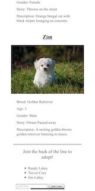

Petful

Petful is an animal adoption app. You can add your name to the bottom of the list and when it is your turn you can adopt either a cat or a dog. 

 

You can find the live app here: https://petful-client-template-three.vercel.app/

 

Screenshots:

 

 

 

Technology:

Front End:
    -React
    -HTML
    -CSS(No frameworks)

Production:
    -Deployed using Vercel    

-------------------------

Getting Started

Run npm install to load dependencies

Run npm test to ensure a stable build

This is only the front end client, to develop locally you'll need the backend server as well.

To get the backend up and running see https://github.com/LeahArden175/plant-dex-server

Deployments are handled through vercel and can be run via npm run deploy